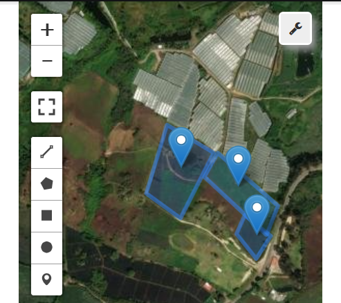

## 1. Introducción y Justificación

El municipio de Sibaté, ubicado en el departamento de Cundinamarca, se caracteriza por presentar condiciones edafoclimáticas propias del trópico alto andino, las cuales resultan idóneas para el establecimiento de sistemas frutícolas de alto rendimiento. De acuerdo con los registros históricos y recientes del Instituto de Hidrología, Meteorología y Estudios Ambientales (IDEAM), esta región exhibe un clima predominantemente frío y húmedo, con precipitaciones bimodales y microclimas que favorecen el desarrollo agrícola continuo. En sincronía con esto, los estudios de clasificación de tierras del Instituto Geográfico Agustín Codazzi (IGAC) categorizan gran parte de los suelos de la sabana cundinamarquesa y sus laderas colindantes dentro de las clases de mayor capacidad agrológica del país.

Bajo estas ventajas comparativas, el cultivo de la fresa (*Fragaria x ananassa*) se ha consolidado como uno de los renglones productivos de mayor importancia socioeconómica en Colombia. Cundinamarca lidera la producción nacional de esta fruta, siendo el cultivar 'Albion' el predominante en Sibaté. Sin embargo, la arañita roja (*Tetranychus urticae* Koch) es categorizada como la plaga de mayor impacto económico. Reportes técnicos advierten que *T. urticae* es capaz de ocasionar pérdidas económicas que alcanzan entre el **60%** y el **80%** del rendimiento si no se establecen medidas de mitigación tempranas.

Frente a los desafíos de un control químico ineficaz y costoso, la implementación de tecnologías de la información espacial, como la geomática, representa un avance fundamental para el monitoreo dinámico y la prevención epidemiológica. En la presente investigación se propone la aplicación de un modelo geoespacial basado en la lógica del álgebra de mapas mediante la estructuración de un Índice de Favorabilidad de Plaga (IFP).

## 2. Objetivos

### General

Formular un modelo geoespacial predictivo basado en álgebra de mapas para anticipar el riesgo de infestación de *Tetranychus urticae* en el cultivo de fresa (*Fragaria x ananassa* cv. Albion) bajo condiciones de trópico alto en Sibaté, Cundinamarca.

### Específicos

1. Identificar variabilidad topoclimática (DEM).

2. Caracterizar la variabilidad microclimática y el vigor vegetal de la zona de estudio mediante la integración de teledetección (Landsat y Sentinel-2) e interpolación geoestadística avanzada (Kriging Ordinario).

3. Estructurar un Índice de Favorabilidad de Plaga (IFP) a nivel intrapredial mediante modelamiento multicriterio y álgebra de mapas, ponderando variables difusas de temperatura, humedad relativa y proximidad espacial a inóculos previos.

4. Validar la significancia estadística y la robustez del modelo espacial propuesto evaluando la correlación entre las zonas de alto riesgo (IFP) y los niveles de estrés fisiológico del cultivo detectados mediante el Índice de Vegetación de Diferencia Normalizada (NDVI).

## 3. Área de Estudio Interactiva

A continuación se presenta el mapa de la zona de estudio en Sibaté con las unidades de muestreo delimitadas.

*(Ver código fuente del visor interactivo)*

```python
import leafmap.foliumap as leafmap
# Centramos el mapa en la zona de lotes en Sibaté

lat, lon = 4.4754, -74.2618

m = leafmap.Map(center=[lat, lon], zoom=17)

m.add_basemap("SATELLITE")

m

```



## 4. Estado del Arte

La integración de herramientas geomáticas en el Manejo Integrado de Plagas (MIP) ha evolucionado significativamente en la última década, pasando de monitoreos manuales a sistemas de alerta temprana basados en teledetección y modelamiento geoespacial. En el caso de *Tetranychus urticae*, diversas investigaciones han demostrado que el uso de sensores remotos es una alternativa eficaz para detectar ataques de ácaros en estadios iniciales. Autores como **Prabhakar et al. (2022)** han señalado que el Índice de Vegetación de Diferencia Normalizada (NDVI) y el Índice de Clorofila son sensibles a la pérdida de pigmentos fotosintéticos causada por la succión celular del ácaro, permitiendo identificar focos de infestación antes de que el daño sea irreversible para el rendimiento.

A nivel de modelamiento ambiental, la literatura científica destaca la estrecha dependencia de *T. urticae* con las variables termohigrométricas. Estudios realizados por **Brizuela-Torres et al. (2021)** resaltan que las altas temperaturas y las condiciones de baja humedad relativa aceleran drásticamente el desarrollo embrionario y la tasa de oviposición de la plaga. En este contexto, la aplicación de técnicas de interpolación geoestadística, como el **Kriging Ordinario**, ha permitido a investigadores en agricultura de precisión mapear microclimas intra-prediales con alta fidelidad, superando las limitaciones de los promedios regionales de estaciones meteorológicas convencionales (IDEAM).

El uso del **Álgebra de Mapas** y el **Análisis Multicriterio (MCE)** se ha consolidado como la metodología estándar para la zonificación de riesgos fitosanitarios. Investigaciones en el trópico alto han comenzado a implementar la Lógica Difusa (*Fuzzy Logic*) para ponderar factores ambientales y topográficos. Según **Moraes et al. (2023)**, la proximidad a fuentes de inóculo y la incidencia de vientos predominantes (modelados mediante DEM) son variables críticas que, al ser operadas matemáticamente en una calculadora ráster, permiten generar mapas de probabilidad de ocurrencia de plagas con una precisión superior al **85%**.

En Colombia, si bien se han realizado avances en la caracterización biológica de la plaga bajo condiciones controladas, existe un vacío en el desarrollo de modelos predictivos espaciales aplicados específicamente al cultivar **'Albion'** en sistemas productivos de ladera como los de Sibaté. La presente propuesta se fundamenta en estos precedentes para escalar el análisis de la escala de laboratorio a la escala de paisaje, utilizando el poder computacional de **Google Earth Engine** y lenguajes de alto rendimiento como **Julia** para validar la robustez de los modelos geoespaciales generados.

## 5. Metodología Propuesta

**5.1. Diseño del flujo de trabajo (Pipeline Geoespacial)**
La presente investigación se desarrollará mediante un enfoque cuantitativo de modelamiento espacial, integrando un *pipeline* automatizado que articula computación en la nube, sistemas de información geográfica (SIG) y lenguajes de programación de alto rendimiento. La orquestación del proyecto se realizará en **VS Code** mediante Quarto, utilizando la API de Python de **Google Earth Engine (GEE)** para la extracción masiva de datos, **QGIS/ArcGIS Pro** para el procesamiento ráster y el lenguaje **Julia** para la validación estadística robusta.

**5.2. Adquisición de datos y variables topoclimáticas (DEM)**
Se implementará una estrategia de teledetección multiespectral y térmica. Para el vigor vegetal (NDVI), se filtrarán imágenes del satélite **Sentinel-2** con nubosidad inferior al 10%. Para la temperatura superficial (LST), se emplearán bandas térmicas de **Landsat 8/9** remuestreadas a 10 m. En cumplimiento del primer objetivo específico, se procesará un Modelo de Elevación Digital (**DEM ALOS PALSAR**) de 12.5 m de resolución para generar capas derivadas de pendiente (*Slope*) y orientación solar (*Aspect*), factores críticos que condicionan el microclima de ladera en Sibaté.

**5.3. Interpolación geoestadística y construcción del IFP**
Dada la naturaleza puntual de los datos meteorológicos, se generarán superficies continuas de humedad relativa y temperatura mediante **Kriging Ordinario**, técnica que permite modelar la autocorrelación espacial en relieves complejos. Una vez obtenidas las capas, se procederá a su normalización difusa (escala 0 a 1) para ejecutar el **Álgebra de Mapas** mediante la calculadora ráster, aplicando la ecuación del Índice de Favorabilidad de Plaga (IFP):

$$IFP = (0.5 \cdot T_{norm}) - (0.3 \cdot H_{norm}) + (0.2 \cdot V_{prox})$$

Donde $T_{norm}$ representa la temperatura normalizada (óptimo en 27 °C), $H_{norm}$ la humedad relativa inversa y $V_{prox}$ el análisis de proximidad euclidiana a focos de inóculo previos.

**5.4. Validación estadística y rigor del modelo (Julia)**
La validación del modelo se realizará en el lenguaje **Julia** (librerías *DataFrames.jl* y *GeoStats.jl*) por su eficiencia en el manejo de grandes volúmenes de datos. Se ejecutará una validación cruzada (*Cross-Validation*) para determinar el Error Cuadrático Medio (RMSE) de las interpolaciones. Finalmente, se evaluará la correlación de Spearman entre los valores de riesgo predichos (IFP) y el estrés vegetal real detectado por el NDVI en una muestra aleatoria de 500 puntos, estableciendo un nivel de significancia de $p < 0.05$ para confirmar la robustez predictiva del modelo.

## 6. Referencias Bibliográficas

Corporación Colombiana de Investigación Agropecuaria [AGROSAVIA]. (2022). *Manual de manejo integrado de plagas en el cultivo de fresa (Fragaria x ananassa)*. Mosquera, Colombia: Editorial Agrosavia.

Brizuela-Torres, D., Santillán-Galicia, M. T., & Guzmán-Franco, A. W. (2021). Influence of microclimate and temperature on the population dynamics of *Tetranychus urticae* (Acari: Tetranychidae) in horticultural crops. *Experimental and Applied Acarology*, 84(2), 345-361. https://doi.org/10.1007/s10493-021-00624-z

Instituto Colombiano Agropecuario [ICA]. (2022). *Manejo fitosanitario del cultivo de la fresa: Vigilancia y control de Tetranychus urticae*. Ministerio de Agricultura y Desarrollo Rural de Colombia.

Instituto de Hidrología, Meteorología y Estudios Ambientales [IDEAM]. (2024). *Atlas Climatológico de Colombia: Análisis de la variabilidad climática en el departamento de Cundinamarca*. Ministerio de Ambiente y Desarrollo Sostenible.

Instituto Geográfico Agustín Codazzi [IGAC]. (2023). *Estudio General de Suelos y Zonificación de Tierras del Departamento de Cundinamarca a escala 1:100.000*. Subdirección de Agrología.

Kirschbaum, D. S. (2021). Fresa: Tendencias y perspectivas en el control de la plaga clave araña roja (*Tetranychus urticae*). En G. Fischer & D. Miranda (Eds.), *Avances en el cultivo de berries en el trópico alto* (pp. 59-72). Sociedad Colombiana de Ciencias Hortícolas.

Moraes, R., Silva, A. M., & Xavier, V. (2023). Map algebra and fuzzy logic for pest risk mapping: A geospatial approach in precision agriculture. *Computers and Electronics in Agriculture*, 205, 107-121. https://doi.org/10.1016/j.compag.2023.107621

Prabhakar, M., Gopinath, K. A., & Thirupathi, M. (2022). Remote sensing and vegetation indices (NDVI) for early detection of biotic stress in intensive horticultural systems. *Journal of Agrometeorology*, 24(1), 15-28.