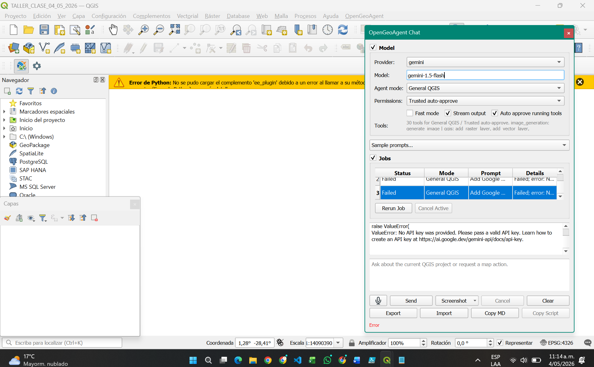

## [cite_start]EJERCICIO EN CLASE [cite: 1]

[cite_start]**Estudiante:** Manuel Ignacio Lozano Vargas [cite: 2]  
[cite_start]**ID:** 1005715544 [cite: 2]

---

### Reporte de Actividad

[cite_start]Se realizó el trabajo en clase; sin embargo, se presentaron dificultades técnicas al momento de ejecutar el mapa. [cite_start]La actividad quedó documentada hasta este punto y se presentó formalmente el avance del proyecto.

### Evidencia del Proceso

A continuación se muestra la configuración del Plugin **OpenGeoAgent** en QGIS y el estado del error de validación de la API Key:

---

**Institución:** Universidad Nacional de Colombia - Sede Bogotá